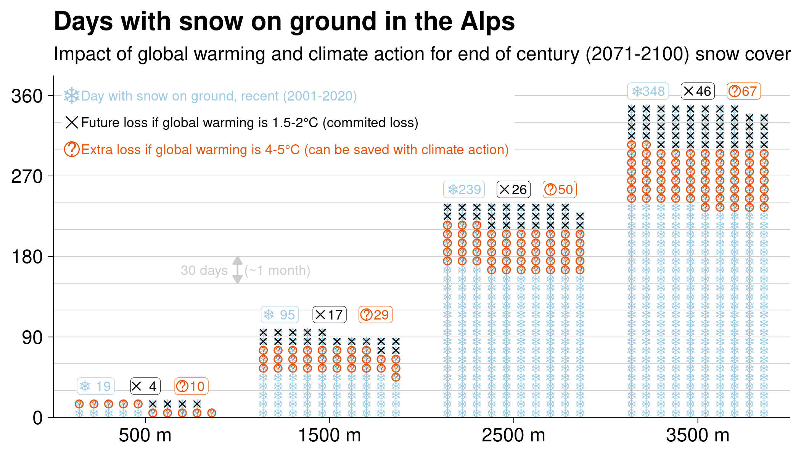

Future snow cover fraction in the European Alps and the impact of greenhouse gas concentration scenarios. 

Regional climate models not only provide projections on temperature and precipitation, but also on snow. Here, we employed statistical post-processing using satellite observations to reduce bias and uncertainty from model projections of future snow-covered area and duration under different greenhouse gas concentration scenarios for the European Alps. Snow cover area/duration decreased overall in the future, three times more strongly with 4--5° global warming as compared to 1.5--2°. 

The paper is available [here](https://doi.org/10.5194/hess-26-3037-2022), and to be cited as:

> Matiu, M. and Hanzer, F.: Bias adjustment and downscaling of snow cover fraction projections from regional climate models using remote sensing for the European Alps, Hydrol. Earth Syst. Sci., 26, 3037–3054, https://doi.org/10.5194/hess-26-3037-2022, 2022.

## See also 

- The associated [dataset](/research/data_future_alps/) 
- Some visualizations in the [dashboard](/dash-results/)
<!-- - The [media coverage](/communication/media-coverage-alpine-snow-paper/) -->

## Abstract

Mountain seasonal snow cover is undergoing major changes due to global climate change. Assessments of future snow cover usually rely on physically based models, and often include post-processed meteorology. Alternatively, we here propose a direct statistical adjustment of snow cover fraction from regional climate models by using long-term remote-sensing observations. We compared different bias-adjustment routines (delta change, quantile mapping, and quantile delta mapping) and explored a downscaling based on historical observations for the Greater Alpine Region in Europe. All bias-adjustment methods account for systematic biases, for example due to topographic smoothing, and reduce model spread in future projections. The trend-preserving methods delta change and quantile delta mapping were found to be more suitable for snow cover fraction than quantile mapping. Averaged over the study region and whole year, snow cover fraction decreases from 12.5 % in 2001--2020 to 10.4 % (8.9 %, 11.5 %; model spread) in 2071--2100 under RCP2.6 (representative concentration pathway), and to 6.4 % (4.1 %, 7.8 %) under RCP8.5 (bias-adjusted estimates from quantile delta mapping). In addition, changes strongly depended on season and elevation. The comparison of the statistical downscaling to a high-resolution physically based model yields similar results for the elevation range covered by the climate models, but different elevation gradients of change above and below. Downscaling showed overall potential but requires further research. Since climate model and remote-sensing observations are available globally, the proposed methods are potentially widely applicable but are limited to snow cover fraction.

## Summary figure

